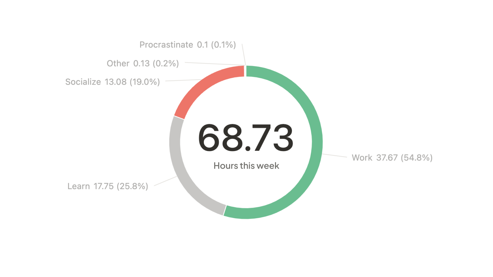
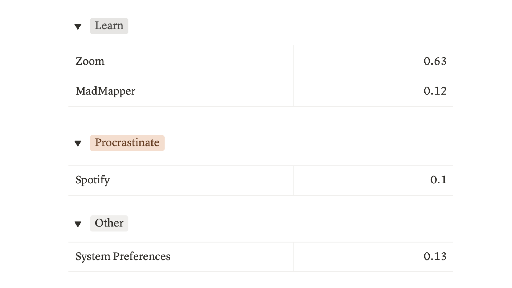
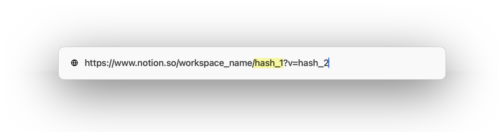

Sync your Screen Time data from Mac and iOS devices to Notion automatically.




## Quick Setup

```bash
# 1. Configure Notion
python -m src.main configure



# 2. Set up automatic daily sync at 9 PM
./setup_cron.sh

# 3. First manual sync to test
python -m src.main sync --setup-schema --days 7
```

## Commands

```bash
# Sync to Notion
python -m src.main sync --days 7

# Check sync status
tail -f sync.log

# Export to CSV
python -m src.main export --output usage.csv

# Show devices
python -m src.main devices

# Categorize apps
python -m src.main categorize "Instagram" "Procrastinate"

# Debug iOS sync
python -m src.main check-ios
```

## What You Get

- **Multi-device tracking**: Mac, iPhone, iPad usage in one place
- **Web usage**: Safari URLs from iOS devices
- **Auto-categorization**: Work, Learn, Socialize, etc.
- **Weekly aggregation**: Clean data in Notion
- **Automatic sync**: Set it and forget it

## Troubleshooting

**No iOS data?**
1. **iOS**: Settings → Screen Time → Share Across Devices (OFF → wait 30sec → ON)
2. **Mac**: System Settings → Screen Time → Share Across Devices (OFF → wait 30sec → ON)
3. Wait 24 hours, then run `python -m src.main check-ios`

**Cron job not working?**
```bash
# Check if cron job exists
crontab -l

# View sync logs
tail -f sync.log
```

**Notion errors?**
```bash
# Test connection
python -m src.main info
```

## Data Schema

Your Notion database will have:
- **App Name**: Instagram, Safari, etc.
- **Device**: 📱 iPhone 15 Pro Max, 💻 Mac
- **Category**: Work, Learn, Procrastinate
- **URL**: Website URLs (for Safari)
- **Hours/Sessions**: Usage metrics
- **Date**: Week starting Monday

## Permissions

Grant "Full Disk Access" to Terminal:
1. System Settings → Privacy & Security → Full Disk Access
2. Add Terminal app
3. Restart Terminal
